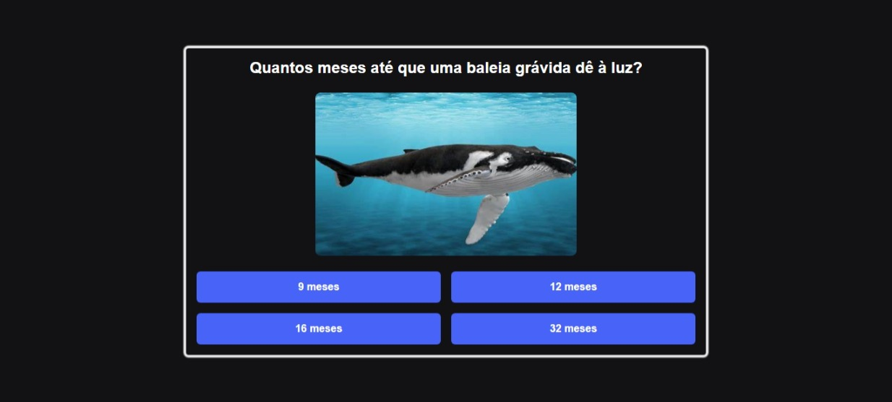

<h1 align="center">Quiz Javascript</h1>

Esse é um projeto de um quiz feito em javascript, totalmente funcional, verifica as respostas corretas e no final soma todas elas.

<a href="#objetivo">Objetivo</a> • <a href="#tecnologias">Tecnologias</a> • <a href="#autor">Autor</a>

<a href="https://esther-cardoso.github.io/quiz-javascript/">Clique aqui para abrir o site</a>

<h2 id="objetivo">Objetivo</h2>

O objetivo desse projeto foi em aprimorar minhas habilidades em HTML, CSS e JavaScript. Eu trabalhei com muitas funcionalidades e eventos.

<h2 id="tecnologias">🛠 Tecnologias</h2>
As seguintes ferramentas foram usadas na construção do projeto:

- HTML
- CSS
- JavaScript

## Autor

<a href="https://www.instagram.com/_esther_cardoso/">
 
  
 <b>Esther Cardoso</b></a>

Feito por Esther Cardoso 👋🏽 Entre em contato!

